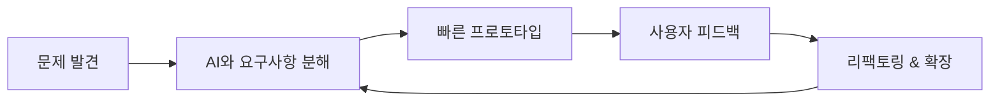

<div align="center">


[](https://git.io/typing-svg)


</div>

---

## 🤖 Agent Profile

```yaml
name: Kim Junho
role: Full-stack Developer
mode: AI-assisted problem solver
core_stack: Node.js, TypeScript, NestJS, Flutter, React
focus: 빠른 프로토타입, 실사용자 피드백, 지속적인 개선
signal: "모르는 영역이 나와도, AI와 함께라면 겁나지 않습니다."
```

낯선 문제도 주저 없이 마주하고, 단순 반복 작업은 AI에 맡겨 본질적인 문제에 집중하는 개발자입니다.<br/>
Node.js + TypeScript 기반 서버 개발을 중심으로 Flutter/React 프론트까지 함께 다루며, 빠르게 만들고 실제 피드백으로 개선하는 흐름을 좋아합니다.

---

## ⚡ Human × AI Workflow



---

## 🧬 Tech Matrix

<div align="center">

### Frontend


### Backend


### Infra & Integration


</div>

---

## 🛰 Mission Logs

- PortOne 결제 연동으로 실제 결제 흐름을 구현했습니다.
- Socket.io 기반 실시간 채팅 기능을 다뤄봤습니다.
- 레퍼런스가 부족한 레거시 본인인증 모듈을 WebView로 연동했습니다.
- 바이브코딩과 AI 협업을 활용해 빠르게 프로토타입을 만들고 개선했습니다.

---

## 📡 Signal From GitHub

<div align="center">


</div>

---

## 🐍 Contribution Snake

<div align="center">


</div>

---

## 🧠 Operating Principles

```txt
READABILITY > cleverness
LEARNING     is always running
AI           handles repetition
HUMAN        owns judgment
```

---

<div align="center">

### Connect

[](https://kimjunho97.tistory.com)
[](https://github.com/kimjuno97)


</div>
