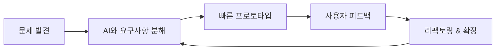

<div align="center">


[](https://git.io/typing-svg)


</div>

---

## 🤖 Agent Profile

```yaml
name: Kim Junho
role: Full-stack Developer
mode: AI-assisted problem solver
core_stack: Flutter, React, Next.js, Node.js, TypeScript, NestJS
focus: 빠른 프로토타입, 실사용자 피드백, 지속적인 개선
signal: "모르는 영역이 나와도, AI와 함께라면 겁나지 않습니다."
```

낯선 문제도 주저 없이 마주하고, 단순 반복 작업은 AI에 맡겨 본질적인 문제에 집중하는 개발자입니다.<br/>
Node.js + TypeScript 기반 서버 개발을 중심으로 Flutter/React/Next.js 프론트까지 함께 다루며, 빠르게 만들고 실제 피드백으로 개선하는 흐름을 좋아합니다.

---

## ⚡ Human × AI Workflow



---

## 🧬 Tech Matrix

<div align="center">

### Frontend


### Backend


### Infra & Integration


</div>

---

## 🛰 Mission Logs

- Flutter, React, Next.js로 클라이언트 화면과 상태 흐름을 구현합니다.
- Riverpod, Flutter Bloc, GetX 기반의 Flutter 상태관리 경험이 있습니다.
- Node.js, TypeScript, NestJS로 백엔드 API와 서버 구조를 설계합니다.
- GraphQL, RESTful API, TypeORM, SQL 기반 데이터 흐름을 다룹니다.
- Firebase와 Supabase를 활용해 인증, 데이터, 스토리지 흐름을 구성합니다.
- 로컬 서버, Socket 통신, 실시간 게임 로직 구현에 관심과 경험이 있습니다.
- AI 협업을 활용해 빠르게 프로토타입을 만들고 개선합니다.

---

## 📡 Current Signal

```txt
STATUS       Building with AI
INTEREST     Full-stack prototyping
FLOW         Problem -> Prototype -> Feedback -> Improve
NEXT QUEST   더 빠르게 만들고, 더 선명하게 다듬기
```

---

## 🧠 Operating Principles

```txt
READABILITY > cleverness
LEARNING     is always running
AI           handles repetition
HUMAN        owns judgment
```

---

<div align="center">

### Connect

[](https://kimjunho97.tistory.com)
[](https://github.com/kimjuno97)


</div>
